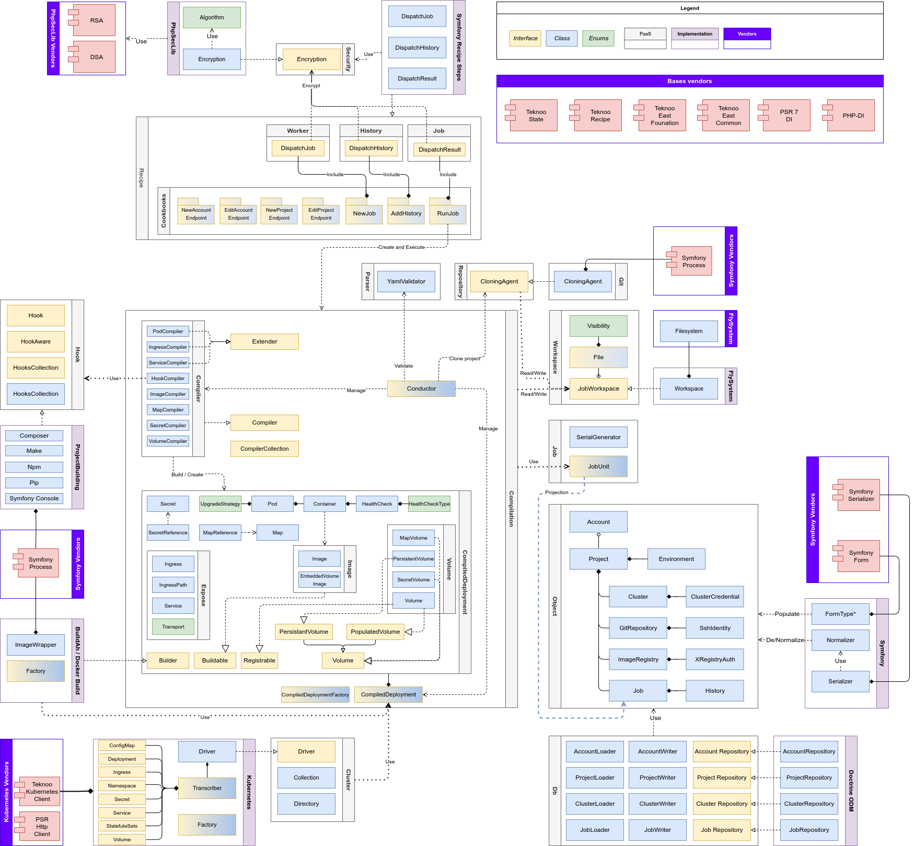

Teknoo Software - PaaS library
==============================

Introduction
------------

`East PaaS` is an universal package, following the #East programming philosophy, build on 
[Teknoo East Foundation](https://github.com/TeknooSoftware/east-foundation) and 
[Recipe](https://github.com/TeknooSoftware/recipe) to implement a custom 
[PaaS](https://en.wikipedia.org/wiki/Platform_as_a_service) manager like [Platform.sh](https://platform.sh/).

This library is able to fetch a project on a source repository (like `Git`) in a temporary folder, read a deployment
file (by default, called `.paas.yaml`) run some hooks to install vendors (with `composer`, `npm`, `pip`, etc..), compile
or other  (`make`, `symfony console`), warmup cache, create OCI image (with `buildah` or `docker build`) and deploy the
project them in a cluster (`kubernetes`).

The deployment on `Kubernetes` includes :
- `Namespace`
- `ReplicaSets` or `Deployments` (with `Pods`)
- `ConfigMap` and `Secrets`
- `Service` and `Ingress`

`Teknoo East PaaS` is compatible with `Docker` or any `OCI implementation` (like `BuildAh`) and `Kubernetes`.
An implementation with `Docker Swarm` can be added.

`Teknoo East PaaS` is bundled with a default implementation with `Symfony` 6.4 or newer and `Doctrine ODM MongoDB` to
persist data.

Architecture and Behavior
-------------------------

`East PaaS` is build on `East Foundation` and `Recipe`. The central set of components is the `Compilation` namespace.
This set of components is in charge to "translate" (compile) the `.paas.yaml` file to an PHP Object instance
`CompiledDeployment`.

Persisted Data (`Account`, `Project`, `Job`) are managed by `East Common`. They are not responsibility in deployments,
but they are used to create a `JobUnit` instance (it is not persisted object), mandatory to get projects's data,
like source repository, cluster, credentials. Logs of deployment are also stored into `Job`.

`East PaaS` has three majors algorithms / Plan, described later :
* A plan to create a new deployment (aka a `Job`) from a `Project` (not run it).
  * Fetch the account and the project from the "database".
  * Create the JobUnit instance.
  * Dispatch it to a bus (like `Symfony Messenger`).
* A plan to tun a deployment (aka a `Job`).
  * Fetch a job from a bus (like `Symfony Messenger`).
  * Clone the project locally.
  * Run hooks to install vendors, run test, compile, build app and warm up cache.
  * Create Docker/OCI images, and push them into a private registry.
  * Deploy and expose the app (For `Kubernetes`, create manifest and apply it through the HTTP API).
* A plan to persist deployment's logs in a `Job` instance.
  * Fetch an entry from a bus (like `Symfony Messenger`).
  * Fetch the job from the "database".
  * Add the entry, as an `History` instance, in the `Job`.

Theses plans use differents components described above. All messages send to the bus, and fetched from it
can be encrypted thanks to `Security` contract defined in `src`.

`East PaaS` use generic plans provided  by `East Common` to list, create, edit, delete and view :
* `Account`
* `Project`
* `Job`

*To create or edit and `Account` or a `Project`, `East PaaS` override `Common` plans. They are also
described later in the `Data Plans` part.* 

Defaults implementations
------------------------

`East PaaS` is bundled with some default implementations, available in the `infrastructures` folder:
* `Symfony` and `Laminas`:
  * inherits `East Common`, to render page, manage forms, match HTTP Routes.
  * To perform normalization and serialization.
  * To dispatch message on a bus. 
* `Doctrine ODM MongoDb` :
  * inherits `East Common`, to persist `Account`, `Project`, `Job`
* `Flysystem`: to manage job's workspace where projects will be cloned and built.
* `Git` (thanks to `Symfony Process`) to clone a project
* `Docker/Buildah` (thanks to `Symfony Process`) to create Docker/OCI image.
  _(Or any tools compliant with the Docker build command line)_
* `Kubernetes` (thanks to `Teknoo Kubernetes Client` and any `PSR Http Client` implementation) :
  to deploy an application to a cluster
* `PhpSecLib` : To implement `Security` contracts and encrypt or decrypt message through the bus.
* `Composer/Npm/PIP/Make/Symfony Console` (thanks to `Symfony Process`) to provide some hooks to build projects

Require to be implemented in the final application
--------------------------------------------------

To use this library in your application, you must implement some stuff :
* Some handlers to intercepts and run in worker (via a bus like `Symfony Messenger` or via an HTTP API Endpoint):
  * `HistorySent` and `JobDone` messages (run the plan `AddHistory`)
  * `MessageJob` (run the plan `RunJob`)
  * Create a new job (run the plan `NewJob`)
* Add routes (for `Symfony` from `infrastructures/Symfony/Bundle/config`, but you can also use your routes).
  to manage `Account`, `Project`, `Job` and `User`

Main Plans
--------------

### Project : Start a new deployment (a new job)

**This plan will only create a new deployment, not run it**
_You must handle message dispatched in the `DispatchJob` step to run the job_

### Project : Run a job

### Project : Persist a job's log (add an history)

Data Management Plan
------------------------

### Account : Create
Inherits the `East Common CreateObjectEndPoint Plan`.

_The `ObjectAccessControl` step is optional. You can define the step in the DI. It will be automatically injected
in the plan. To perform a control access on an account._

### Account : Edit
Inherits the `East Common EditObjectEndPoint Plan`.

_The `ObjectAccessControl` step is optional. You can define the step in the DI. It will be automatically injected
in the plan. To perform a control access on an account._

### Project : Create
Inherits the `East Common CreateObjectEndPoint Plan`.

_The `ObjectAccessControl` step is optional. You can define the step in the DI. It will be automatically injected
in the plan. To perform a control access on a project._

### Project : Edit
Inherits the `East Common EditObjectEndPoint Plan`.

_The `ObjectAccessControl` step is optional. You can define the step in the DI. It will be automatically injected
in the plan. To perform a control access on a project._

